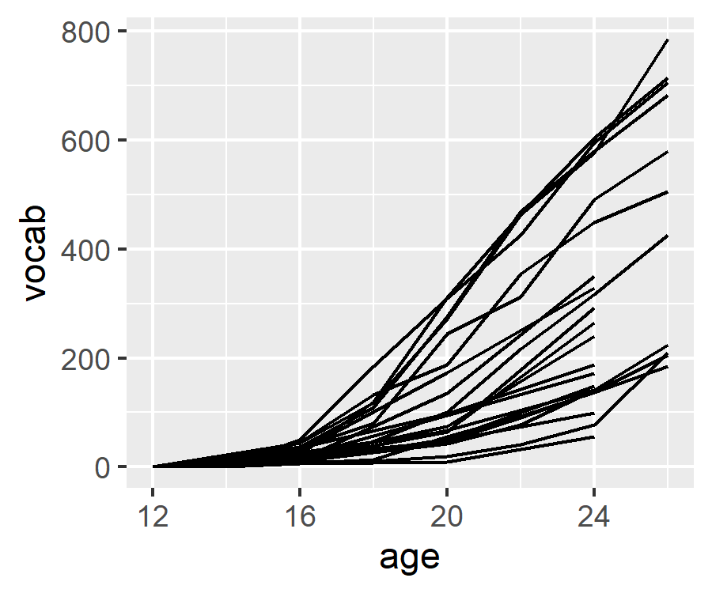
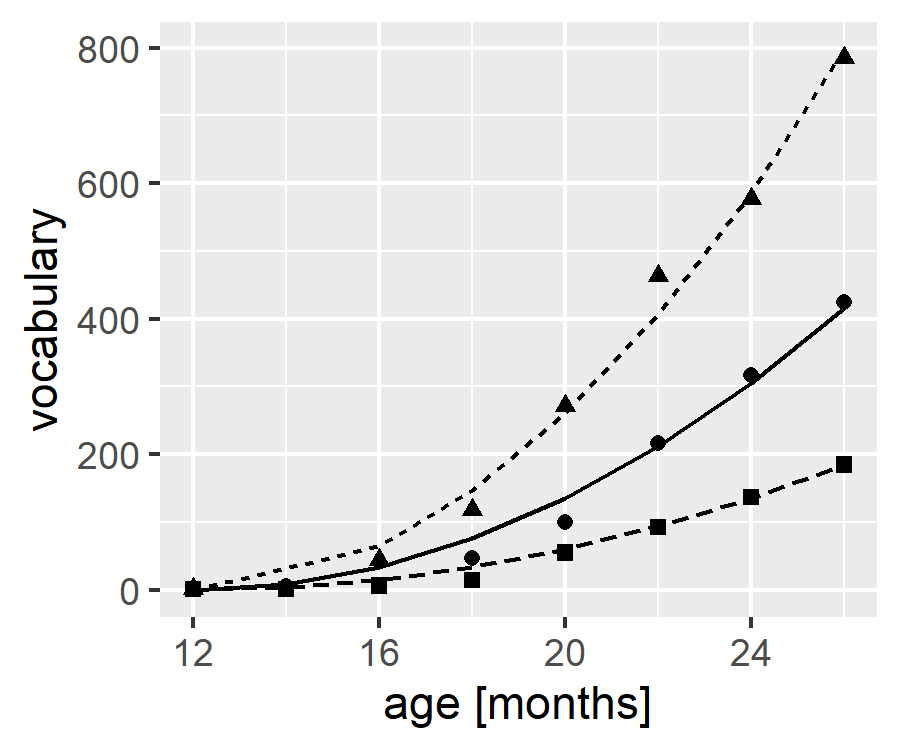

<!-- README.md is generated from README.Rmd. Please edit that file -->

# huttenlocher1991

<!-- badges: start -->
<!-- badges: end -->

This package provides the vocabulary growth data from the following
article:

> Huttenlocher, J., Haight, W., Bryk, A., Seltzer, M., & Lyons, T.
> (1991). Early vocabulary growth: Relation to language input and
> gender. *Developmental Psychology*, *27*(2), 236–248.
> <https://doi.org/10.1037/0012-1649.27.2.236>

This dataset is useful educationally because it features
longitudinal/repeated measures growth data. It is also unusual because
in the associated article, the only fixed effect predictor for growth is
quadratic time–that is, there are no intercept or linear time terms.

## Installation

You can install the development version of huttenlocher1991 like so:

``` r
remotes::install_github("tjmahr/huttenlocher1991)
```

## Example

Here are the data all plotted.

``` r
library(huttenlocher1991)
library(tidyverse)

vocab_growth
#> # A tibble: 126 x 9
#>       id mom_speak   sex group log_mom   age vocab age_12 age_12_sq
#>    <dbl>     <dbl> <dbl> <dbl>   <dbl> <dbl> <dbl>  <dbl>     <dbl>
#>  1     1       694     0     0    6.54    12     1      0         0
#>  2     1       694     0     0    6.54    16    13      4        16
#>  3     1       694     0     0    6.54    18    34      6        36
#>  4     1       694     0     0    6.54    20    47      8        64
#>  5     1       694     0     0    6.54    22    90     10       100
#>  6     1       694     0     0    6.54    24   139     12       144
#>  7     1       694     0     0    6.54    26   205     14       196
#>  8     2      4485     0     0    8.41    12     1      0         0
#>  9     2      4485     0     0    8.41    14     6      2         4
#> 10     2      4485     0     0    8.41    16    46      4        16
#> # ... with 116 more rows

ggplot(vocab_growth) + 
  aes(x = age, y = vocab) + 
  geom_line(aes(group = id))
```



Here is the “obvious” fully specified growth model.

``` r
library(lme4)
#> Loading required package: Matrix
#> 
#> Attaching package: 'Matrix'
#> The following objects are masked from 'package:tidyr':
#> 
#>     expand, pack, unpack

m <- lmer(
  vocab ~ age_12 + age_12_sq + (age_12 + age_12_sq | id),
  vocab_growth
)
#> Warning in checkConv(attr(opt, "derivs"), opt$par, ctrl = control$checkConv, :
#> Model failed to converge with max|grad| = 0.020193 (tol = 0.002, component 1)
summary(m)
#> Linear mixed model fit by REML ['lmerMod']
#> Formula: vocab ~ age_12 + age_12_sq + (age_12 + age_12_sq | id)
#>    Data: vocab_growth
#> 
#> REML criterion at convergence: 1271
#> 
#> Scaled residuals: 
#>      Min       1Q   Median       3Q      Max 
#> -2.07195 -0.39694 -0.00812  0.48806  2.86833 
#> 
#> Random effects:
#>  Groups   Name        Variance Std.Dev. Corr       
#>  id       (Intercept) 124.2578 11.1471             
#>           age_12       57.4728  7.5811  -0.99      
#>           age_12_sq     0.4649  0.6818  -0.91  0.83
#>  Residual             672.1137 25.9252             
#> Number of obs: 126, groups:  id, 22
#> 
#> Fixed effects:
#>             Estimate Std. Error t value
#> (Intercept)  -3.7165     5.6644  -0.656
#> age_12       -0.3510     2.3938  -0.147
#> age_12_sq     2.0362     0.1946  10.464
#> 
#> Correlation of Fixed Effects:
#>           (Intr) age_12
#> age_12    -0.781       
#> age_12_sq  0.059 -0.046
#> optimizer (nloptwrap) convergence code: 0 (OK)
#> Model failed to converge with max|grad| = 0.020193 (tol = 0.002, component 1)
```

They note in footnote 2 that there was high collinearity between
π<sub>1*i*</sub> and π<sub>2*i*</sub> (the two random slopes) which we
see above.

They use a reduced quadratic model, which I think was basically:

``` r
mr <- lmer(
  vocab ~  0 + age_12_sq + (0 + age_12_sq | id),
  vocab_growth
)
summary(mr)
#> Linear mixed model fit by REML ['lmerMod']
#> Formula: vocab ~ 0 + age_12_sq + (0 + age_12_sq | id)
#>    Data: vocab_growth
#> 
#> REML criterion at convergence: 1298.3
#> 
#> Scaled residuals: 
#>      Min       1Q   Median       3Q      Max 
#> -2.24964 -0.47214 -0.00006  0.10853  3.05852 
#> 
#> Random effects:
#>  Groups   Name      Variance Std.Dev.
#>  id       age_12_sq   1.421   1.192  
#>  Residual           821.099  28.655  
#> Number of obs: 126, groups:  id, 22
#> 
#> Fixed effects:
#>           Estimate Std. Error t value
#> age_12_sq    1.966      0.256   7.679
```

There is no intercept because at x = 0 (age = 12 months), vocabulary
should be 0 (?).

If I include `group`, I can reproduce the coefficients from Table 1,
which makes me think I am on the right track.

``` r
mr_group <- lmer(
  vocab ~  0 + age_12_sq + age_12_sq:group + (0 + age_12_sq | id),
  vocab_growth
)
summary(mr_group)
#> Linear mixed model fit by REML ['lmerMod']
#> Formula: vocab ~ 0 + age_12_sq + age_12_sq:group + (0 + age_12_sq | id)
#>    Data: vocab_growth
#> 
#> REML criterion at convergence: 1292.7
#> 
#> Scaled residuals: 
#>      Min       1Q   Median       3Q      Max 
#> -2.26343 -0.45712 -0.00655  0.14346  3.05227 
#> 
#> Random effects:
#>  Groups   Name      Variance Std.Dev.
#>  id       age_12_sq   1.156   1.075  
#>  Residual           820.791  28.649  
#> Number of obs: 126, groups:  id, 22
#> 
#> Fixed effects:
#>                 Estimate Std. Error t value
#> age_12_sq         2.5171     0.3258   7.726
#> age_12_sq:group  -1.1099     0.4629  -2.398
#> 
#> Correlation of Fixed Effects:
#>             ag_12_
#> ag_12_sq:gr -0.704
```

Finally, we can recreate the figures:

``` r
library(broom.mixed)
data <- mr %>% 
  augment(newdata = vocab_growth)

ggplot(data %>% filter(id %in% c(11, 5, 7))) +
  aes(x = age, y = vocab, shape = factor(id)) +
  geom_point() +
  geom_line(aes(y = .fitted, linetype = factor(id))) + 
  guides(shape = "none", linetype = "none") + 
  labs(x = "age [months]", y = "vocabulary")
```



``` r
knitr::include_graphics("man/figures/f1.png")
```


Excluding the intercept entirely reminded me of nonlinear models, so can
we just one of those?

``` r
nform <- ~ beta * input ^ 2
nfun <- deriv(
  nform, 
  namevec = "beta", 
  function.arg = c("input", "beta")
)

mr_nl <- nlmer(
  vocab ~ nfun(age_12, beta) ~ beta | id, 
  data = vocab_growth, 
  start = c(beta = 0)
)

summary(mr_nl)
#> Nonlinear mixed model fit by maximum likelihood  ['nlmerMod']
#> Formula: vocab ~ nfun(age_12, beta) ~ beta | id
#>    Data: vocab_growth
#> 
#>      AIC      BIC   logLik deviance df.resid 
#>   1303.4   1311.9   -648.7   1297.4      123 
#> 
#> Scaled residuals: 
#>      Min       1Q   Median       3Q      Max 
#> -2.24507 -0.47379  0.00078  0.10689  3.06098 
#> 
#> Random effects:
#>  Groups   Name Variance Std.Dev.
#>  id       beta   1.355   1.164  
#>  Residual      821.047  28.654  
#> Number of obs: 126, groups:  id, 22
#> 
#> Fixed effects:
#>      Estimate Std. Error t value
#> beta   1.9665     0.2502    7.86

fixef(mr_nl)
#>     beta 
#> 1.966504
fixef(mr)
#> age_12_sq 
#>  1.966307

VarCorr(mr_nl)
#>  Groups   Name Std.Dev.
#>  id       beta  1.1642 
#>  Residual      28.6539
VarCorr(mr)
#>  Groups   Name      Std.Dev.
#>  id       age_12_sq  1.1919 
#>  Residual           28.6548
```
